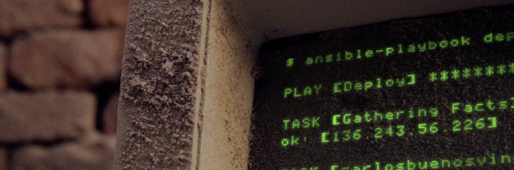

<a href="https://amaurybsouza.github.io/portfolio/"><a/><a 
href="https://twitter.com/amaurybsouza_"><a/><a
href="https://www.linkedin.com/in/amaurybsouza/"><a/><a href="https://amauryborgesouza@gmail.com"><a/><a href="https://amaurybsouza.medium.com/"><a/><a href="https://linktr.ee/amaurybsouza"><a/><a href="https://gitlab.com/amauryborgesouza"><a/>

